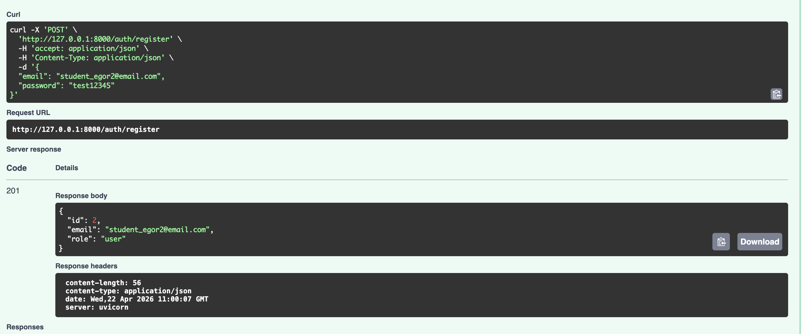
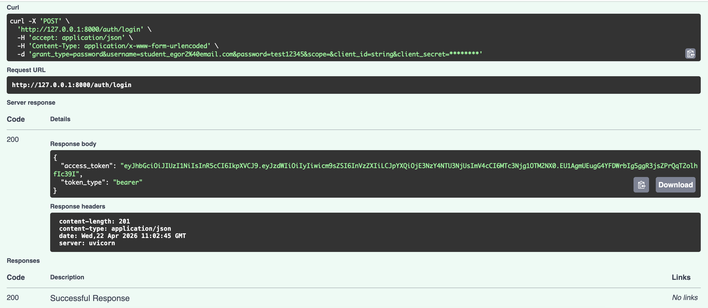
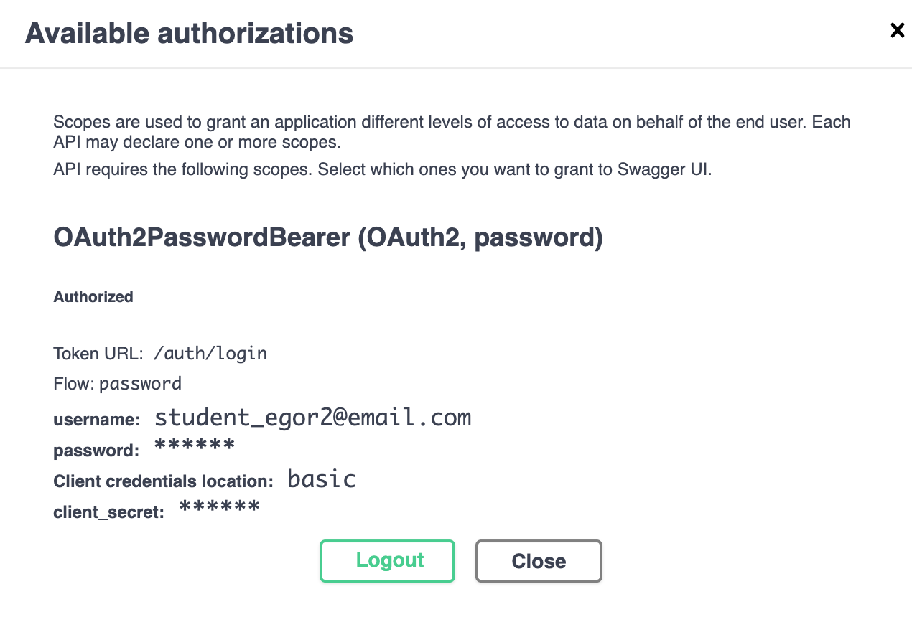
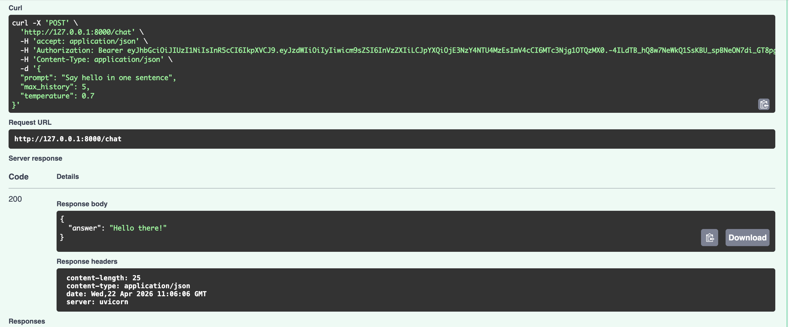
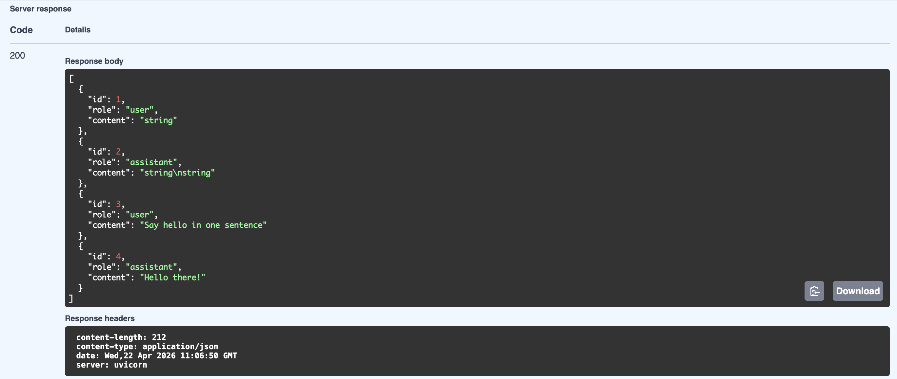
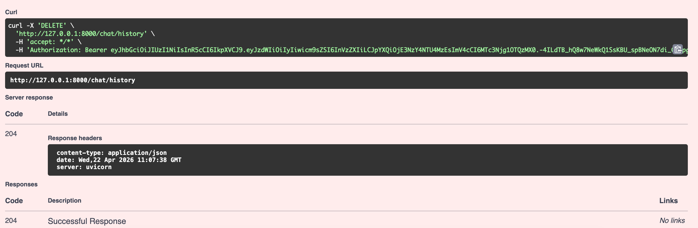
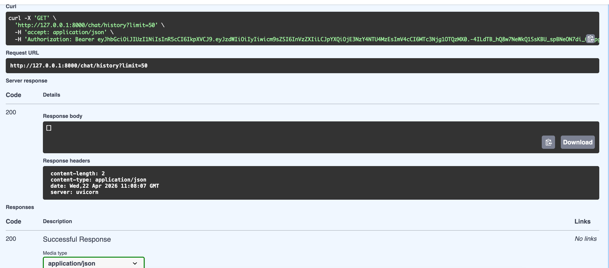

# llm-p

FastAPI-приложение с JWT-аутентификацией, SQLite, хранением истории диалога и проксированием запросов к LLM через OpenRouter.

## Особенности

- бизнес-логика вынесена в `usecases`
- работа с БД изолирована в `repositories`
- внешний LLM вынесен в отдельный `service`
- dependency injection реализован через `Depends`
- API-слой не содержит SQL и бизнес-логики

## Установка и запуск через uv

### 1. Установка uv

```bash
pip install uv
```

### 2. Создание виртуального окружения

```bash
uv venv
source .venv/bin/activate
```

Для Windows:

```bat
.venv\Scripts\activate.bat
```

### 3. Установка зависимостей

Зависимости уже описаны в `pyproject.toml`.

```bash
uv pip install -r <(uv pip compile pyproject.toml)
```

### 4. Настройка `.env`

Создайте файл `.env` по примеру `.env.example` и заполните его:

```env
APP_NAME=llm-p
ENV=local

JWT_SECRET=change_me_super_secret
JWT_ALG=HS256
ACCESS_TOKEN_EXPIRE_MINUTES=60

SQLITE_PATH=./app.db

OPENROUTER_API_KEY=your_api_key
OPENROUTER_BASE_URL=https://openrouter.ai/api/v1
OPENROUTER_MODEL=stepfun/step-3.5-flash:free
OPENROUTER_SITE_URL=https://example.com
OPENROUTER_APP_NAME=llm-fastapi-openrouter
```

### 5. Запуск приложения

```bash
uv run uvicorn app.main:app --reload --host 0.0.0.0 --port 8000
```

### 6. Swagger

После запуска документация будет доступна по адресу:

```text
http://127.0.0.1:8000/docs
```

## Проверка сценария работы

1. Зарегистрируйте пользователя через `POST /auth/register`.
2. Выполните вход через `POST /auth/login` и получите JWT-токен.
3. Нажмите `Authorize` в Swagger и вставьте токен.
4. Отправьте запрос в `POST /chat`.
5. Проверьте историю через `GET /chat/history`.
6. Очистите историю через `DELETE /chat/history`.

## Регистрация



## Логин



## Авторизация



## Chat



## History



## Delete



## Empty history


